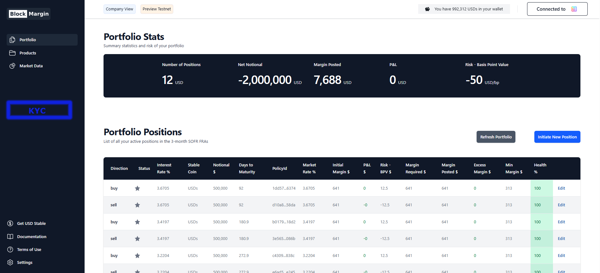

# BlockMargin on Midnight

### App

Launch NextJs app with `npm run dev` from root directory

### Presentation

https://docs.google.com/presentation/d/1oJ0s8Lm46bt9QaYQEoX611qP0AQ8EX9-Mb6XIqcOqN8/edit?usp=sharing

### Context

BlockMargin is a blockchain-based platform for settling 
Interest Rate Derivatives (IRDs). It is designed to streamline 
how banks and companies trade these products and how the 
resulting lifecycle events are managed. By automating 
settlement and enforcement, BlockMargin can reduce operational 
costs for banks and open the IRD market to smaller companies
and eventually, to retail customers.

> ⚠️ KYC REQUIREMENT to be Implemented on Midnight for the BlockMargin app on Cardano

Interest Rate Derivatives allow companies to manage uncertainty 
around future interest rates. Many companies, especially in 
manufacturing, plan over long horizons. But central banks 
set interest rates monthly, creating a mismatch between corporate 
planning needs and short-term rate decisions.

Banks bridge this gap. They allow companies to “lock in” 
long-term rates, transforming short-term central-bank rates 
into long-term pricing that companies can use for budgeting. 
Banks profit from this service.

#### The Problem With Today’s IRD Market

Derivative contracts are complex. They specify how the contract is valued, 
how payments are calculated, and when the contract can end. 
Enforcing these agreements traditionally requires legal processes or arbitration.

Because these deals require extensive negotiation and ongoing operational effort, 
banks typically only engage in them when the potential profit is high enough. 
This usually means:

- Very large notional trade sizes (often multi-million-dollar contracts), or

- Significant mark-ups above the fair market rate.

As a result, only large companies can access these products at 
reasonable prices. Smaller companies and retail clients face high costs, 
and trades under USD 1 million notional are rarely executed.

#### How BlockMargin Improves This

BlockMargin moves the definition and enforcement of IRD contracts onto a blockchain:

- Smart contracts encode the financial terms and automatically enforce payment conditions.

- Stablecoins are used to settle profits and losses.

- The blockchain acts as the neutral “enforcer,” removing 
the need for legal arbitration in most cases.

- Smart contracts also manage events such as defaults.

Because all terms and calculations are automated, operational costs fall dramatically, 
making smaller trades economically viable.

#### Privacy Is Essential

Banks and companies deal with highly sensitive financial information. 
For blockchain to be a viable platform for IRDs, 
it must include privacy-preserving features. 
This is why BlockMargin needs to run on a privacy-enabled blockchain such as Midnight

We have developed a proof of concept on Cardano 
showing how interest rate derivatives can be settled on a 
blockchain using smart contracts and stablecoins.

To move toward real-world testing with banks, we need to complete two major features:

- Onboarding for Companies and Banks, with selective disclosure of sensitive information.

- Migration of smart contracts to a privacy-preserving blockchain, such as Midnight.

### Next Steps
**1. Build a KYC Onboarding System**

We will develop a secure process where companies and banks can submit their 
confidential information. This data remains private but can be selectively 
disclosed to authorized counterparties upon request.

Example workflow:

<u>Companies</u>

- Connect via their Lace wallet
- Complete onboarding, including submitting financial details and documents
- Create IRD trade proposals and publish them on the Order Book
- Choose which banks they are willing to trade with
- Request additional information from banks where needed

<u>Banks</u>

- Connect via their Lace wallet
- Complete their own onboarding and document submission
- See only the companies that have selected them as potential counterparties
- Request required KYC/AML information from those companies
- Review the disclosures and approve the companies they want to trade with
- Once approved, banks see only the trades from vetted companies in the Order Book

Companies may limit exposure to specific banks for risk-management or board-mandated reasons.
Banks may be restricted by regulation, jurisdiction, KYC/AML rules, or internal policies.
Selective disclosure ensures privacy while still enabling safe and compliant trading relationships.

**2. Port BlockMargin to a Privacy Preserving Blockchain**

BlockMargin was always intended to run on a privacy blockchain. 
After exploring options like Ocean and evaluating approaches with 
Cardano Marlow, we concluded that privacy features on public blockchains were insufficient.

We plan to port BlockMargin to Midnight, a privacy-preserving smart contract platform.

Engage banks to test how this technology can streamline their operations 
and expand their client base.

Tokenizing financial derivatives is a logical next step for bringing 
real-world financial instruments onto blockchain rails.

#### Appendix 1: Required Company Information

- Company Name
- Company Address
- VAT Tax Number
- DUNS Number (optional)
- Legal Entity Identifier (LEI)
- Certificate of Incorporation
- Board Resolution authorizing the use of Interest Rate Derivatives for hedging